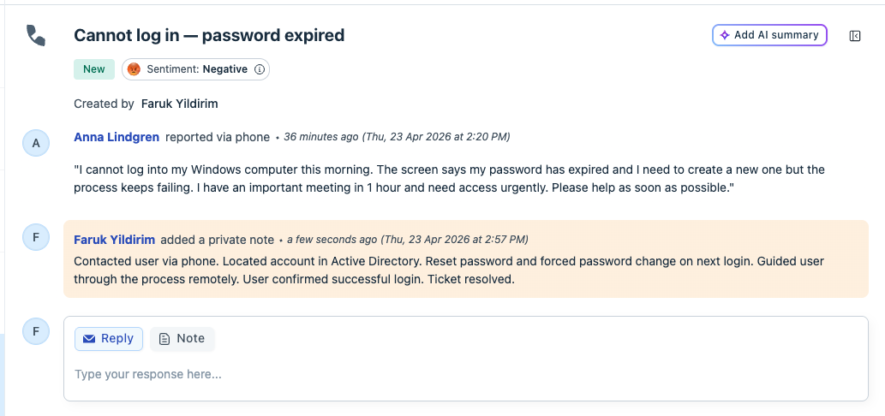
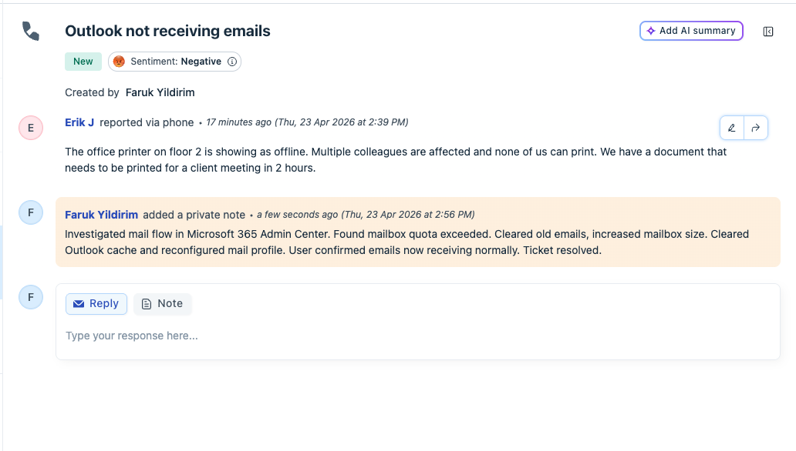
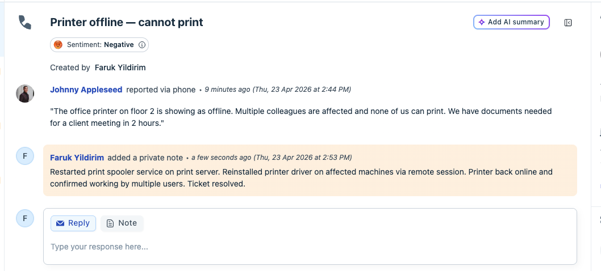
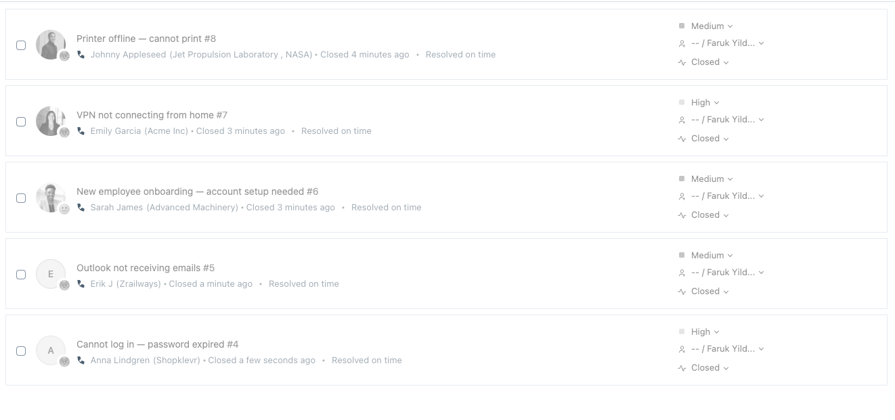
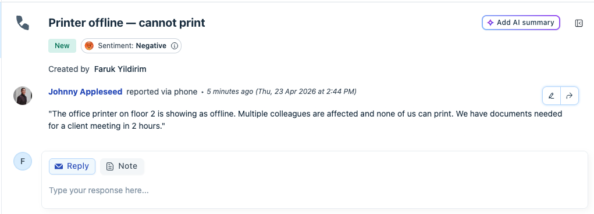
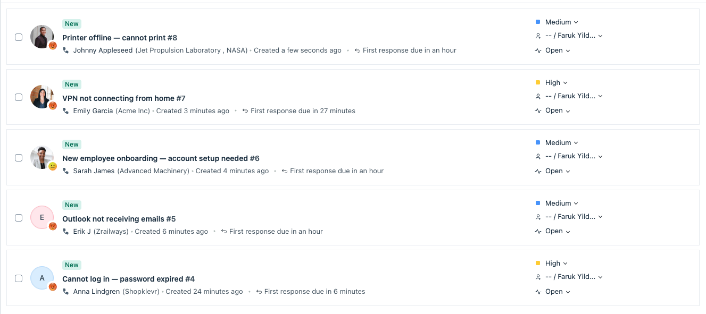

# 🖥️ IT Support Helpdesk Lab — Freshdesk Ticketing System

> A simulated IT helpdesk environment built to demonstrate real-world first-line support workflows, ITIL-inspired ticket management, and technical troubleshooting across common enterprise IT scenarios.

---

## 📌 Project Overview

This project simulates a fully functional IT helpdesk using **Freshdesk**, covering the most common issues a first-line support technician encounters daily. All tickets are created, triaged, documented and resolved following structured ITIL-inspired practices.

The goal is to demonstrate hands-on understanding of:
- Ticket lifecycle management (Open → In Progress → Resolved → Closed)
- Priority classification and SLA awareness
- Technical troubleshooting across AD, M365, hardware and networking
- Clear and professional resolution documentation

---

## 🛠️ Tools & Technologies

| Tool | Purpose |
|------|---------|
| Freshdesk | Helpdesk & ticketing platform |
| Active Directory | User account & password management |
| Microsoft 365 Admin Center | Mailbox, license & Exchange administration |
| Windows 10/11 | Client OS troubleshooting |
| Remote support (simulated) | Phone & remote guided resolution |

---

## 📁 Folder Structure

```
it-support-lab/
│
├── README.md
│
└── ITIL-LAB/
    ├── Overview-ALL-TICKETS.png
    ├── Closed_tickets_overview.png
    ├── Closed_ticket.png
    ├── Closed_ticket-4.png
    ├── closed_ticket-5.png
    ├── Resolving_note_added.png
    └── Ticket_printer_before_resolve.png
```

---

## 🎫 Ticket Scenarios

### Ticket #4 — Cannot log in: Password expired
**Priority:** 🟡 High  
**Source:** Phone  
**Category:** Account Management / Active Directory  

**Issue:**
> "I cannot log into my Windows computer this morning. The screen says my password has expired. I have an important meeting in 1 hour and need access urgently."

**Resolution:**
> Contacted user via phone. Located account in Active Directory. Reset password and forced password change on next login. Guided user through the process remotely. User confirmed successful login. Ticket resolved.

**Screenshot:**


---

### Ticket #5 — Outlook not receiving emails
**Priority:** 🔴 Urgent  
**Source:** Phone  
**Category:** Microsoft 365 / Exchange  

**Issue:**
> "My Outlook has not received any new emails since this morning. I can send but cannot receive. I am expecting important documents from a client."

**Resolution:**
> Investigated mail flow in Microsoft 365 Admin Center. Found mailbox quota exceeded. Cleared old emails, increased mailbox size. Cleared Outlook cache and reconfigured mail profile. User confirmed emails now receiving normally. Ticket resolved.

**Screenshot:**


---

### Ticket #6 — New employee onboarding — account setup needed
**Priority:** 🔵 Normal  
**Source:** Email  
**Category:** Onboarding / Account Provisioning  

**Issue:**
> "New employee Lars Nilsson starts this Monday. He will need an Active Directory account, Microsoft 365 license, laptop configured with standard software and access to the shared HR drive."

**Resolution:**
> Created Active Directory account for Lars Nilsson. Assigned Microsoft 365 E3 license. Configured laptop with standard software package — Office 365, VPN client, antivirus. Granted access to HR shared drive. Notified HR that setup is complete. Ticket resolved.

**Screenshot:**


---

### Ticket #7 — VPN not connecting from home
**Priority:** 🟡 High  
**Source:** Phone  
**Category:** Network / Remote Access  

**Issue:**
> "I cannot connect to the company VPN from home. Getting error: Authentication failed. It worked fine last week."

**Resolution:**
> Identified expired VPN certificate as root cause. Pushed updated certificate remotely via MDM. Guided user through VPN reconnection steps via phone. User confirmed VPN working. Updated documentation with certificate renewal schedule. Ticket resolved.

**Screenshot:**


---

### Ticket #8 — Printer offline — cannot print
**Priority:** 🔵 Medium  
**Source:** Phone  
**Category:** Hardware / Print Services  

**Issue:**
> "The office printer on floor 2 is showing as offline. Multiple colleagues are affected and none of us can print. We have documents needed for a client meeting in 2 hours."

**Resolution:**
> Restarted print spooler service on print server. Reinstalled printer driver on affected machines via remote session. Printer back online and confirmed working by multiple users. Ticket resolved.

**Screenshots:**

Before resolution:


Resolution note added:


---

## 📊 Ticket Overview

### All tickets — Open view


### All tickets — Closed/Resolved view


---

## ✅ Key Skills Demonstrated

- **Active Directory** — password reset, account creation, permission management
- **Microsoft 365** — mailbox administration, quota management, license assignment
- **ITIL-inspired workflow** — ticket triage, prioritization, documentation, resolution
- **Hardware support** — printer troubleshooting, driver management, print spooler
- **Network/Remote access** — VPN certificate management, remote guided support
- **Onboarding** — end-to-end new user provisioning across AD and M365
- **Documentation** — clear, structured resolution notes for every ticket

---

## 🔗 Related Projects

| Project | Description |
|---------|-------------|
| [Agentic Companion](https://github.com/FrkYldrm1/agentic-companion) | Bachelor thesis — Agentic AI with human-in-the-loop control |
| [MQTT Smart Security](https://github.com/FrkYldrm1/MQTT-Smart-Security) | IoT security system with Raspberry Pi and MQTT |
| [Portfolio](https://frkyldrm.dev) | Personal portfolio — chat with my AI assistant |

---

## 👤 Author

**Mehmet Faruk Yıldırım**  
BSc Computer Science — Linnéuniversitetet 2025  
📧 mhmt.faruk.yildirim@gmail.com  
🌐 [frkyldrm.dev](https://frkyldrm.dev)  
💼 [linkedin.com/in/mfarukyildirim](https://linkedin.com/in/mfarukyildirim)  
🐙 [github.com/FrkYldrm1](https://github.com/FrkYldrm1)

---

> 💬 *Want to know more about my background? Visit [frkyldrm.dev](https://frkyldrm.dev) and chat with my AI assistant!*
